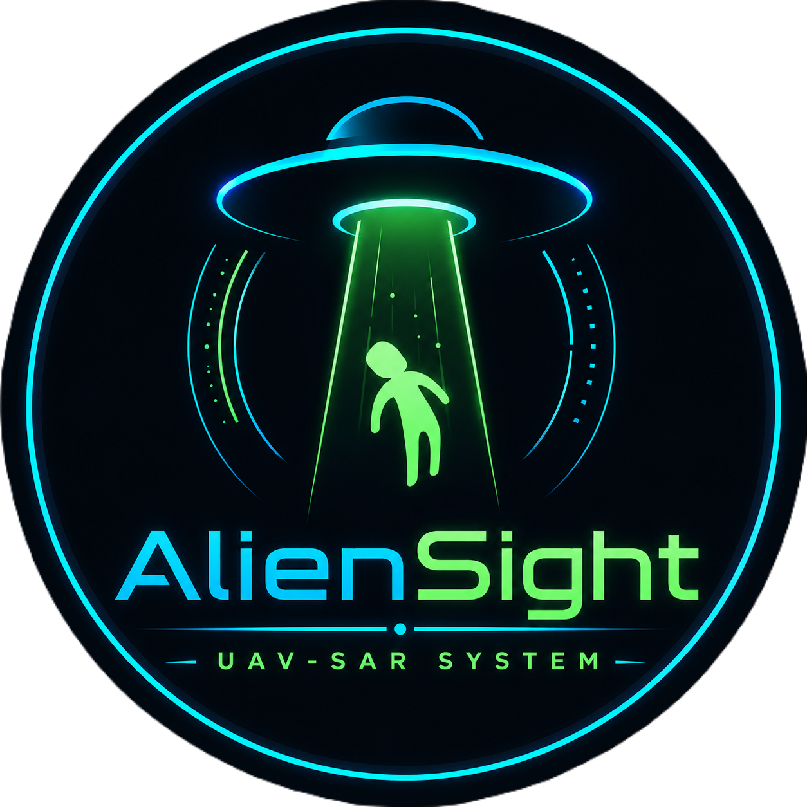
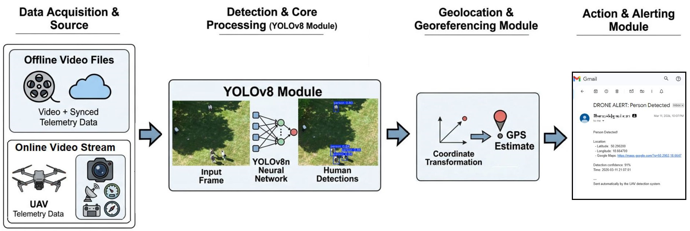
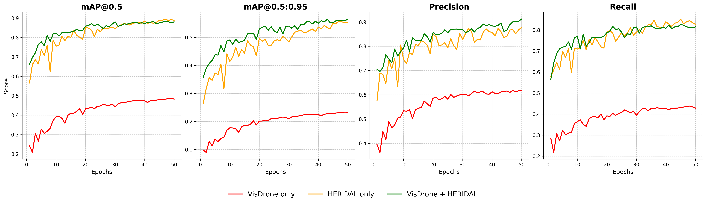
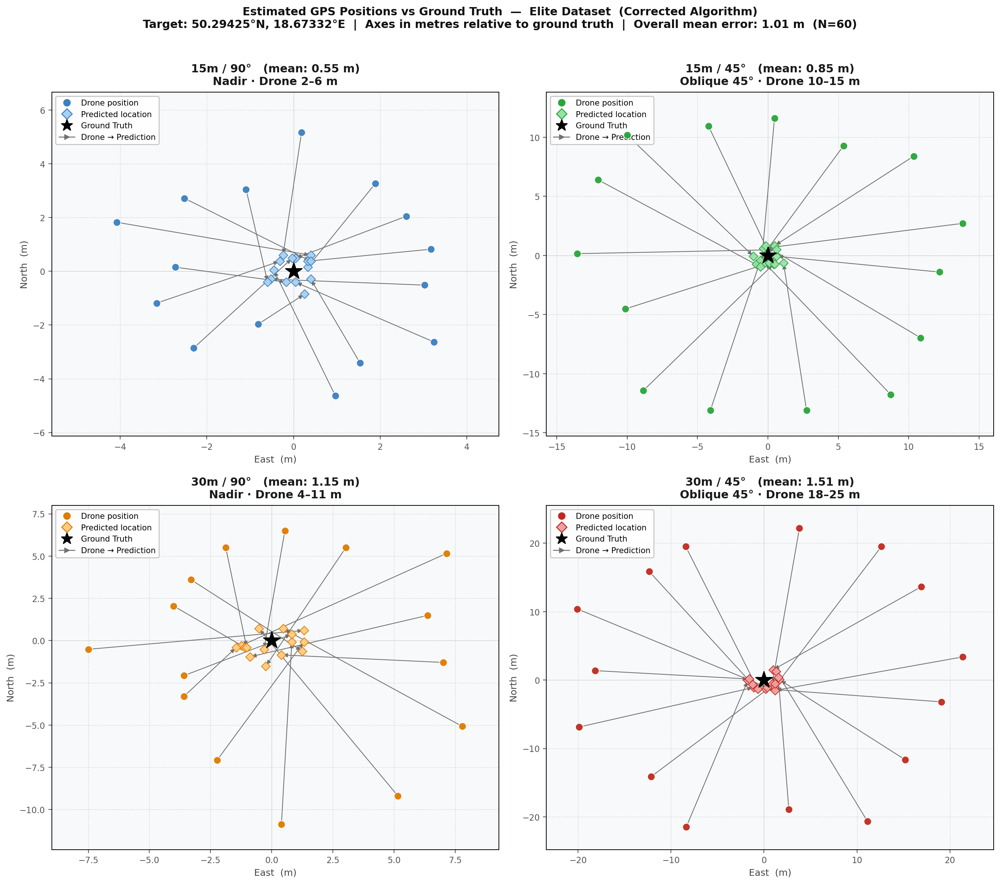
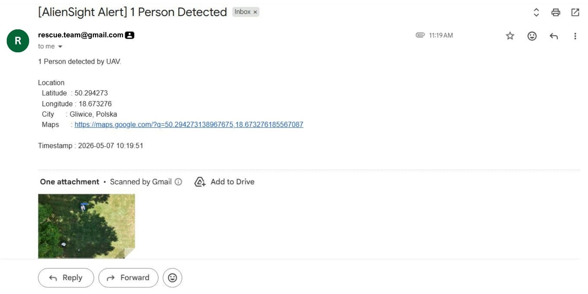
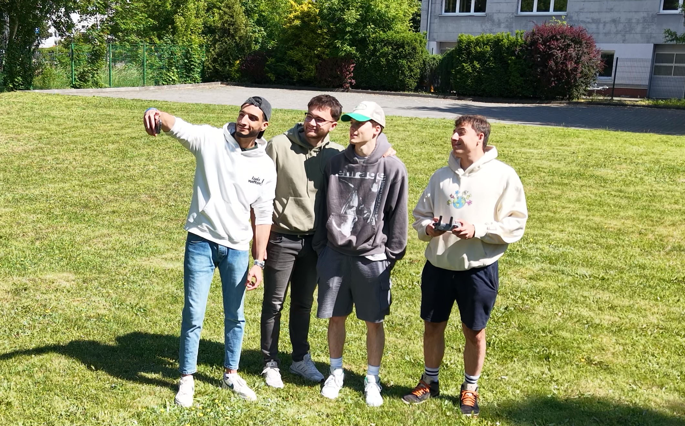

<div align="center">



# AlienSight UAV-Based Human Detection & Geolocation for Search and Rescue

**Real-time onboard AI system that detects humans from drone footage and converts bounding-box pixels into GPS coordinates with zero extra sensors.**

[](https://python.org)
[](https://ultralytics.com)
[](LICENSE)
[](https://universe.roboflow.com/neptunet-bewas/uav-sar-human-detection-dataset)
[](#)
[](#)

<br/>

📄 [Full Technical Paper (arXiv)](#) &nbsp;·&nbsp; 📦 [Dataset (Roboflow)](https://universe.roboflow.com/neptunet-bewas/uav-sar-human-detection-dataset) &nbsp;·&nbsp; 🚀 [GitHub Repository](https://github.com/7amzaGH/UAV-SAR-Human-Detection-and-Geolocation)

Full end-to-end demo: live detection, GPS estimation, and automated email alert.


</div>

---

## Table of Contents

- [Overview](#overview)
- [System Architecture](#system-architecture)
- [Hardware Setup](#hardware-setup)
- [Dataset](#dataset)
- [Geolocation Algorithm](#geolocation-algorithm)
- [Results](#results)
  - [Detection Performance](#detection-performance)
  - [Geolocation Accuracy](#geolocation-accuracy)
  - [Inference Performance](#inference-performance)
- [Email Alert](#email-alert)
- [Quick Start](#quick-start)
- [Usage in Python](#usage-in-python)
- [Repository Structure](#repository-structure)
- [Team](#team)
- [Citation](#citation)
- [Acknowledgments](#acknowledgments)

---

## Overview

Search and rescue (SAR) missions are time-critical. AlienSight is a fully autonomous UAV pipeline that:

- **Detects humans** in aerial footage using a two-stage fine-tuned YOLOv8n model
- **Geolocates each detection** by projecting bounding-box pixels into real-world GPS coordinates using only onboard telemetry no IMU, no depth sensor, no stereo camera
- **Alerts the rescue team** automatically via email with GPS coordinates, a Google Maps link, and an annotated detection snapshot
- **Runs on the edge** optimized for NVIDIA Jetson (PyTorch) and Qualcomm RB3 Gen 2 (ONNX/NPU)


---

## System Architecture

<p align="center">
  
</p>

The pipeline has four stages running in sequence per frame:

1. **Telemetry** GPS, altitude, and heading are read from a serial NMEA stream (live) or a DJI `.SRT` file (offline)
2. **Detection** YOLOv8n runs inference and returns bounding boxes with confidence scores
3. **Geolocation** each bounding-box center is projected to GPS via the geometric algorithm described below
4. **Alerting** on first detection, an email with coordinates and an annotated frame is dispatched to the rescue team

---

## Hardware Setup

All field experiments were conducted using the **DJI Air 3S** drone.

<p align="center">
  
  <br/>
  <em>DJI Air 3S used for all data collection and field evaluation.</em>
</p>

| Specification | Value |
|---|---|
| Camera resolution | 4K (3840 × 2160) @ 60 FPS |
| Camera FOV | 84° diagonal · 76° horizontal · 49° vertical |
| Onboard GPS | Dual-frequency GPS + GLONASS |
| Telemetry source | DJI SRT file per-frame GPS, altitude, timestamp |
| Edge computer | NVIDIA Jetson Nano (128-core Maxwell GPU, 4 GB RAM) |
| Tested altitudes | 15 m and 30 m AGL |
| Tested camera angles | 45° oblique and 90° nadir |

---

## Dataset

The custom evaluation dataset is publicly available on Roboflow : **[UAV-SAR-Human-Detection-Dataset](https://universe.roboflow.com/neptunet-bewas/uav-sar-human-detection-dataset)**

<p align="center">
  <a href="https://universe.roboflow.com/neptunet-bewas/uav-sar-human-detection-dataset">
    
  </a>
</p>
<p align="center">
  
  <br/>
  <em>300 annotated frames across 4 flight conditions (15m/30m × 45°/90°).</em>
</p>

- **300 frames** at 1920 × 1080 no augmentation applied
- **4 conditions:** 15 m / 30 m altitude × 45° / 90° camera angle
- **Scenarios:** standing, sitting, lying, groups, and false-positive challenge objects (chairs, bags)
- **License:** CC BY 4.0

> **Note:** This dataset is used for evaluation only it is not part of model training.

---

## Geolocation Algorithm

The core geometric algorithm converts a 2D bounding-box pixel coordinate into a real-world GPS coordinate in three steps, using only the drone's standard onboard GPS.

**No IMU · No depth sensor · No stereo camera.**

**Step 1 Pixel offset -> metric displacement in camera frame**
```
scale_x = (altitude × tan(FOV_H / 2)) / (IMAGE_WIDTH  / 2)
scale_y = (altitude × tan(FOV_V / 2)) / (IMAGE_HEIGHT / 2)

dx = (cx - W/2) × scale_x
dy = (cy - H/2) × scale_y
```

**Step 2 Rotate by drone heading into world North/East frame**
```
dx' = cos(ψ) × dx  −  sin(ψ) × dy
dy' = sin(ψ) × dx  +  cos(ψ) × dy
```

**Step 3 Convert metric offset to GPS degrees**
```
Δlat = (dy' / 40,075,000) × 360
Δlon = (dx' / (40,075,000 × cos(lat_rad))) × 360
```

An oblique gimbal pitch correction is applied in Step 1 to shift the ground footprint forward when the camera is not pointing straight down. See [`src/geolocation.py`](src/geolocation.py) for the full implementation.

---

## Results

### Detection Performance

<p align="center">
  
  <br/>
  <em>YOLOv8n running on field footage — bounding boxes with confidence scores.</em>
</p>

Evaluated on the custom SAR dataset at confidence threshold = 0.5.

| Model | Precision | Recall | mAP@0.5 | mAP@0.5:0.95 |
|---|---|---|---|---|
| VisDrone only | 0.580 | 0.567 | 0.597 | 0.367 |
| HERIDAL only | 0.845 | 0.911 | 0.941 | 0.757 |
| **VisDrone -> HERIDAL (ours)** | **0.921** | **0.926** | **0.965** | **0.776** |

The two-stage sequential fine-tuning (VisDrone -> HERIDAL) consistently outperforms single-dataset training, demonstrating stronger generalization to SAR-specific conditions.

<p align="center">
  
  <br/>
  <em>Detection metrics across the three training strategies.</em>
</p>

---

### Geolocation Accuracy Results

The geolocation algorithm was validated over 60 ground-truth measurements spanning all 4 flight conditions. Errors are reported as the straight-line distance (metres) between the algorithm's GPS estimate and the actual target position measured on the ground.

| Condition | Altitude | Angle | N | Mean Error (m) | Std Dev (m) | Max Error (m) |
|---|---|---|---|---|---|---|
| C1 | 15 m | 90° nadir | 15 | 0.55 | 0.14 | 0.89 |
| C2 | 15 m | 45° oblique | 15 | 0.84 | 0.21 | 1.29 |
| C3 | 30 m | 90° nadir | 15 | 1.16 | 0.29 | 1.56 |
| C4 | 30 m | 45° oblique | 15 | 1.51 | 0.25 | 1.86 |
| **Overall** | | | **60** | **1.01** | **0.43** | **1.86** |

As expected, lower altitude and nadir angle yield the best accuracy. Even at the worst condition (C4: 30 m / 45°), the maximum error stays under 2 metres, well within the operational requirements of a SAR mission.

<p align="center">
  
  <br/>
  <em>Scatter plot of geolocation error across all 60 measurements and 4 flight conditions.</em>
</p>

For a full spatial view of all measurements, see the interactive map: [`outputs/geolocation_map.html`](outputs/geolocation_map.html).
The complete raw results and per-measurement breakdown are available in [`outputs/geolocation_Experiment_results.xlsx`](outputs/geolocation_Experiment_results.xlsx).
The step-by-step evaluation procedure is documented in [`notebooks/SAR_Geolocation_Evaluation.ipynb`](notebooks/SAR_Geolocation_Evaluation.ipynb).

---

### Inference Performance

| Platform | Execution | Input Resolution | Latency | FPS |
|---|---|---|---|---|
| NVIDIA T4 GPU | PyTorch FP32 | 960 × 960 | ~12.6 ms | ~79 |
| Qualcomm RB3 Gen 2 (QCS6490) | ONNX NPU W8A16 | 960 × 960 | **37.3 ms** | **~26.8** |

---

## Email Alert

On first detection, the system automatically sends an alert to the rescue team containing GPS coordinates, a Google Maps link, the estimated city, a timestamp, and an annotated frame attachment.

<p align="center">
  
  <br/>
  <em>Automated email alert received by the rescue team.</em>
</p>

---

## Quick Start

### 1. Clone & Install

```bash
git clone https://github.com/7amzaGH/UAV-SAR-Human-Detection-and-Geolocation.git
cd UAV-SAR-Human-Detection-and-Geolocation
pip install -r requirements.txt
```

### 2. Download Model Weights

Place `best.pt` in the `models/` folder.
Download links: [GitHub Releases](#) · [HuggingFace](#) *(coming soon)*

### 3. Configure

```bash
cp config.yaml.template config.yaml
# Open config.yaml and fill in your paths and email credentials
```

### 4. Run on a Recorded DJI Video (Offline)

Make sure your `.MP4` and matching `.SRT` telemetry file are in the same folder, then:

```bash
python src/main_offline.py --config config.yaml
```

You can also override paths directly:

```bash
python src/main_offline.py --video path/to/video.MP4 --srt path/to/video.SRT
```

### 5. Run Live on Jetson / Edge Device

```bash
python src/main_live.py --config config.yaml
```

A demo SRT telemetry file and detection CSV are included in [`data/`](data/) for testing.

---

## Usage in Python

```python
from src.detect import PTDetector
from src.geolocation import get_real_coords

# Load detector
detector = PTDetector('models/best.pt', conf_threshold=0.6)

# Run inference on a frame (numpy BGR array)
detections = detector.detect(frame)

if detections:
    lat, lon = get_real_coords(
        bbox_center    = detections[0]["center"],
        drone_position = (50.2648, 19.0237, 30),   # (lat, lon, altitude_m)
        drone_heading  = 129,                        # degrees, 0 = North
        gimbal_pitch   = 0,                          # 0 = nadir, -45 = oblique
        camera_config  = {
            "fov_h": 76, "fov_v": 49,
            "image_width": 1920, "image_height": 1080
        }
    )
    print(f"Person detected at: {lat:.6f}, {lon:.6f}")
```

An interactive walkthrough is available in [`notebooks/UAV_SAR_Demo.ipynb`](notebooks/UAV_SAR_Demo.ipynb).

---

## Repository Structure

```
AlienSight/
├── src/
│   ├── main_offline.py     <- Offline pipeline: DJI video + SRT file
│   ├── main_live.py        <- Live pipeline: camera + serial GPS
│   ├── detect.py           <- YOLOv8n inference (PyTorch & ONNX)
│   ├── geolocation.py      <- Pixel -> GPS algorithm
│   ├── srt_reader.py       <- DJI .SRT telemetry parser
│   └── alert.py            <- Email alert with GPS + annotated frame
│
├── models/
│   └── README.md           <- Models note
│
├── notebooks/
│   ├── UAV_SAR_Demo.ipynb               <- Interactive pipeline demo
│   └── SAR_Geolocation_Evaluation.ipynb <- Geolocation accuracy analysis
│
├── data/
│   ├── Demo_15m90d_Data.srt             <- Sample SRT telemetry file
│   ├── detections.csv                   <- Sample detection output
│   └── raw_drone_telemetry.xlsx         <- Raw field experiment telemetry
│
├── outputs/
│   ├── geolocation_Experiment_results.xlsx  <- Full experiment results
│   ├── geolocation_map.html                 <- Interactive geolocation map
│   ├── error_distribution.png
│   ├── error_vs_altitude_angle.png
│   ├── fig_elite_scatter.png
│   ├── best_model_results_summary.png
│   └── three_models_results_summary.png
│
├── assets/                 <- Figures and media for this README
├── config.yaml.template    <- Configuration template
├── requirements.txt
└── README.md
```

---

## Team

**Hamza Ghitri** · Jakub Gutt · Wojciech Seman · Krzysztof Połeć · Mohamed Bendimerad

<p align="center">
  
</p>

---

## Citation

If you use this work in your research, please cite:

```bibtex
@article{ghitri2026aliensight,
  title   = {UAV-Based Human Detection and Geolocation for Search and Rescue},
  author  = {Ghitri, Hamza},
  year    = {2026},
  note    = {arXiv preprint (coming soon)}
}
```

---

## Acknowledgments

- [VisDrone Dataset](https://github.com/VisDrone/VisDrone-Dataset) Tianjin University
- [HERIDAL Dataset](https://zenodo.org/records/5662351) University of Split
- [Ultralytics YOLOv8](https://github.com/ultralytics/ultralytics)

---

## License

MIT License see [LICENSE](LICENSE) for details.

---

<div align="center">
  <sub>Built for search-and-rescue applications. Every second counts.</sub>
</div>
