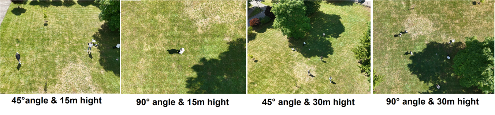
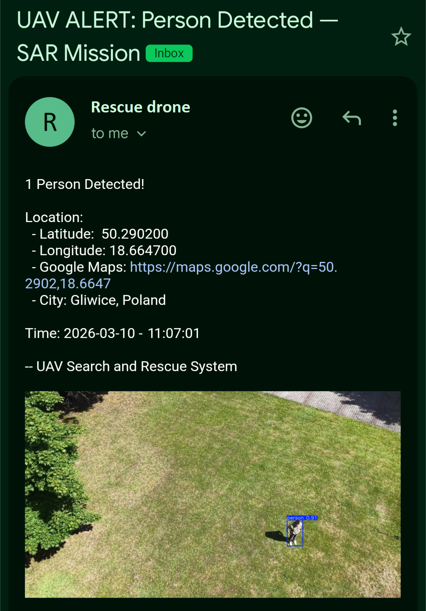

# UAV Human Detection & Geolocation for Search-and-Rescue

Real-time aerial human detection, GPS localization, and automated rescue team alerting using a UAV-mounted YOLOv8n model.

[](https://python.org)
[](https://ultralytics.com)
[](LICENSE)
[](https://universe.roboflow.com/neptunet-bewas/uav-sar-human-detection-dataset)
[](#)

<p align="center">
  
</p>

> Real-time human detection and GPS coordinate estimation from UAV footage for emergency SAR response.

> 📄 [View Full Technical Research (arXiv)](#) &nbsp;|&nbsp; 📦 [Dataset (Roboflow)](https://universe.roboflow.com/neptunet-bewas/uav-sar-human-detection-dataset) &nbsp;|&nbsp; 🚀 [Full code (GitHub)](https://github.com/7amzaGH/UAV-SAR-Human-Detection-and-Geolocation)

---

## Overview

This system addresses the critical need for automated victim localization in Search-and-Rescue (SAR) missions. It combines a two-stage fine-tuned YOLOv8n model with a geometric geolocation algorithm to convert bounding box pixel coordinates into real-world GPS coordinates using only the drone's standard onboard sensors — no additional hardware required.

**Full pipeline:**

```
UAV Video Feed  +  GPS  +  Altitude  +  Heading
        │
        ▼
┌──────────────────────────┐
│   YOLOv8n Detection      │  ← Two-stage: VisDrone → HERIDAL fine-tuning
│   Output: Bounding Box   │    Confidence threshold: 0.6
└────────────┬─────────────┘
             │
             ▼
┌──────────────────────────┐
│   Geolocation Module     │  ← Pixel offset → meters (FOV + altitude)
│   Output: (lat, lon)     │    Heading rotation → GPS delta conversion
└────────────┬─────────────┘
             │
             ▼
┌──────────────────────────┐
│   Email Alert System     │  ← GPS coords + Google Maps + snapshots
│   Output: Alert to team  │    Sent via Gmail SMTP over SSL
└──────────────────────────┘
```

---
## Hardware

All field experiments were conducted using the **DJI Air 3S** drone.

| Specification | Value |
|---|---|
| Camera resolution | 4K (3840 × 2160) @ 60 FPS |
| Camera FOV | 84° diagonal (76° horizontal, 49° vertical) |
| Onboard GPS | Dual-frequency GPS + GLONASS |
| Telemetry | DJI SRT file — per-frame GPS, altitude, timestamp |
| Onboard computer | NVIDIA Jetson Nano (128-core Maxwell GPU, 4 GB RAM) |
| Tested altitudes | 15m and 30m above ground |
| Tested angles | 45° oblique and 90° nadir |

<p align="center">
  
  <br>
  <em>Real-time detection and coordinate estimation using DJI Air 3S footage.</em>
</p>

---

## Dataset

The custom evaluation dataset (300 annotated frames, 4 flight conditions) is publicly available:

**📦 [UAV-SAR-Human-Detection-Dataset on Roboflow](https://universe.roboflow.com/neptunet-bewas/uav-sar-human-detection-dataset)**

<a href="https://universe.roboflow.com/neptunet-bewas/uav-sar-human-detection-dataset">
    
</a>

- 300 frames at 1920×1080 — no augmentation applied
- 4 conditions: 15m/30m altitude × 45°/90° camera angle
- Scenarios: standing, sitting, lying, groups, false positive challenge objects (chairs and bags)
- License: CC BY 4.0



---

## Geolocation Algorithm

The core contribution. Converts a 2D bounding box pixel coordinate into a real-world GPS coordinate in three steps with no additional sensors required.

**Step 1 — Pixel offset to metric displacement**
```
scale_x = (altitude × tan(FOV_H / 2)) / (IMAGE_WIDTH  / 2)
scale_y = (altitude × tan(FOV_V / 2)) / (IMAGE_HEIGHT / 2)
d_x = (cx - W/2) × scale_x
d_y = (cy - H/2) × scale_y
```

**Step 2 — Rotate by drone heading**
```
d_x' = cos(ψ) × d_x  −  sin(ψ) × d_y
d_y' = sin(ψ) × d_x  +  cos(ψ) × d_y
```

**Step 3 — Convert meters to GPS**
```
Δlat = (d_y' / 40,075,000) × 360
Δlon = (d_x' / (40,075,000 × cos(lat_rad))) × 360
```

No IMU · No depth sensor · No stereo camera — only the drone's standard GPS.

---

## Results

### Detection Performance (Custom SAR Evaluation Dataset, threshold = 0.6)

| Model | Precision | Recall | mAP@0.5 | mAP@0.5:0.95 |
|---|---|---|---|---|
| VisDrone only | 0.580 | 0.567 | 0.597 | 0.367 |
| HERIDAL only | 0.845 | 0.911 | 0.941 | 0.757 |
| **VisDrone → HERIDAL (ours)** | **0.921** | **0.926** | **0.965** | **0.776** |

### Geolocation Accuracy (60 measurements, 4 conditions)

| Condition | Mean Error (m) | Std Dev (m) | Max Error (m) |
|---|---|---|---|
| 15m / 90° | 0.61 | 0.18 | 0.94 |
| 15m / 45° | 0.89 | 0.24 | 1.32 |
| 30m / 90° | 1.21 | 0.31 | 1.78 |
| 30m / 45° | 1.64 | 0.42 | 1.97 |
| **Overall** | **1.09** | **0.41** | **1.97** |

### Inference Speed

| Hardware | Role | FPS |
|---|---|---|
| NVIDIA T4 GPU (Google Colab) | Training and evaluation | ~79 |
| NVIDIA Jetson Nano (onboard) | Target deployment | ~5.7 |

---

## Email Alert

Upon detection the system automatically sends an alert to the rescue team:

<p align="center">
  
  <br>
  <em>Automated email alert with GPS coordinates, Google Maps link, and detection snapshots.</em>
</p>

---

## Quick Start

### 1. Clone & Install
```bash
git clone https://github.com/7amzaGH/UAV-SAR-Human-Detection-and-Geolocation.git
cd UAV-SAR-Human-Detection-and-Geolocation
pip install -r requirements.txt
```

### 2. Download model weights
Place `best.pt` in the `models/` folder.
Download: [GitHub Releases](#) · [HuggingFace](#)

### 3. Configure
```bash
cp config.example.yaml config.yaml
# Edit config.yaml — add your email credentials
```

### 4. Run on recorded video
Make sure your `.MP4` and `.SRT` files are in the same folder.
```bash
python src/main_local.py
```

### 5. Run live on Jetson Nano
```bash
python src/main_live.py
```

---

## Usage in Python

```python
from src.detect import HumanDetector
from src.geolocation import get_real_coords

detector = HumanDetector('models/best.pt', conf_threshold=0.6)
detections = detector.detect(frame)

if detections:
    lat, lon = get_real_coords(
        bbox_center    = detections[0]["center"],
        drone_position = (50.2648, 19.0237, 30),  # (lat, lon, altitude_m)
        drone_heading  = 129,
        camera_config  = {"fov_h": 76, "fov_v": 49,
                          "image_width": 1920, "image_height": 1080}
    )
    print(f"Person detected at: {lat:.6f}, {lon:.6f}")
```

---

## Repository Structure

```
UAV-SAR-Human-Detection-and-Geolocation/
├── src/
│   ├── main_local.py       ← Run on recorded DJI video + SRT file
│   ├── main_live.py        ← Run live on Jetson Nano
│   ├── detect.py           ← YOLOv8n inference wrapper
│   ├── geolocation.py      ← Pixel → GPS algorithm
│   ├── srt_reader.py       ← DJI .SRT telemetry parser
│   └── alert.py            ← Email alert with GPS + snapshots
├── models/
│   └── README.md           ← Download link for best.pt
├── assets/
│   ├── demo.gif
│   └── email_alert.png
├── config.example.yaml     ← Template — copy to config.yaml
├── requirements.txt
├── .gitignore
└── README.md
```
---
## Team

Hamza Ghitri • Wojciech Seman • Krzysztof Połeć • Jakub Gutt • Mohamed Bendimerad


## 📄 Citation

If you use this work in your research, please cite:

```bibtex
@misc{uav_sar_2025,
  title   = {UAV Human Detection and Geolocation for Search-and-Rescue Operations},
  author  = {Ghitri, Hamza and Seman, Wojciech and Połeć, Krzysztof and Gutt, Jakub and Bendimerad, Mohamed},
  year    = {2025},
  url     = {https://github.com/YOUR_USERNAME/uav-human-localization},
  note    = {CVaPR Course Project}
}
```

---

## Acknowledgments

- [VisDrone Dataset](https://github.com/VisDrone/VisDrone-Dataset) — Tianjin University
- [Ultralytics YOLOv8](https://github.com/ultralytics/ultralytics)

---

## License

MIT License — see [LICENSE](LICENSE) for details.

---

<div align="center">
  <sub>Built for search-and-rescue applications. Every second counts. 🔴</sub>
</div>

- [VisDrone Dataset](https://github.com/VisDrone/VisDrone-Dataset)
- [Ultralytics YOLOv8](https://github.com/ultralytics/ultralytics)

---
